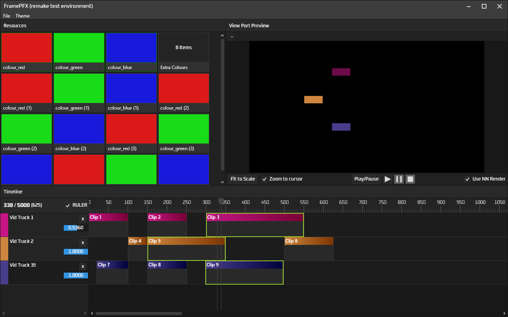

I soon indent to either rename this git repo or just copy all files from this repo into the original FramePFX repo. 

Original repo is https://github.com/AngryCarrot789/FramePFX. I will hopefully soon copy all code from here to that one, and stop updating this repo and continue updating the other one

MVVM is convenient however it's massively slowing down any progress I want to make on it and there are some things that I don't really know how to get around in the original repo, 
which is why I'm converting it to use less MVVM and just use direct control/model access instead

Currently, basic editor functionality works with basic render support. I came up with a new rendering technique that will allow 
async rendering of multiple clips at the same time on other render threads, which will hopefully speed up playback times (see RenderManager)

## Progress so far:

